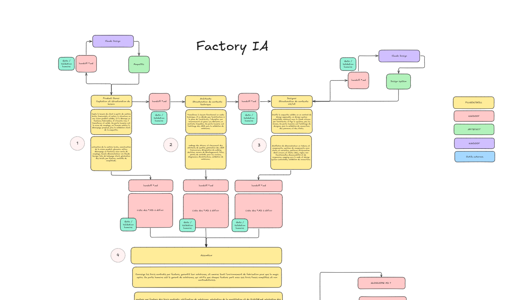

<div align="center">

# Factory IA

**Fabrique logicielle spec-driven pour Claude Code — l'IA propose et structure, l'humain décide.**

| Plugin | Contrat | État |
|--------|---------|------|
| **cadrage** | Fonctionnel — captation du besoin, vision, glossaire, découpage en features (sorties dans `cadrage-out/`) | 🟢 construit |
| **architecte** | Technique — drivers, attributs de qualité, composants, stack, ADR transverses, walking skeleton, conventions/linters, diagrammes (rendus en images PNG) | 🟢 construit |
| **designer** | Design — **atelier de couverture** : ne génère pas le design system ; il garantit que rien n'est oublié et produit le **prompt Claude Design** + le rapport de couverture + le handoff. Le design system naît dans **Claude Design** ; son export est committé dans `designer-out/maquette-de-claude-design/` | 🟢 construit |
| **assembleur** | Convergence — coud les 3 contrats par feature, vérifie la cohérence, crée un **ticket Linear par feature** (via le MCP linear-prism, confirmation ticket par ticket), pose SpecKit (`specify init`) et produit le paquet de handoff (constitution, CLAUDE.md, briefs 3-faces, glossaire, seeds spec.md, CI) | 🟢 construit |




📐 **[Schéma complet & interactif sur Excalidraw](https://app.excalidraw.com/l/7jNppvtCKM7/8hisUsmacFM)**

</div>

---

> **Le principe** — on **fige les contrats en amont**, **l'humain arbitre à chaque étape**, et des **garde-fous déterministes** (sans IA) refusent en aval ce qui n'est pas conforme. L'IA propose et structure ; elle ne décide jamais.

## 🚀 Démarrage rapide

**Prérequis** — Claude Code installé + un accès à l'organisation GitHub `CGI-Shapsha-Factory` (dépôt privé). S'authentifier avec son compte CGI :

```shell
gh auth login        # GitHub.com → HTTPS → compte CGI
```

### Installation (marketplace)

L'installation se fait **uniquement via la marketplace** Claude Code — il n'y a **pas** d'installeur `npx`/Python (l'ancien a été retiré). Chaque plugin est une collection de **skills Markdown** : pas de build, pas de dépendance à installer.

```shell
/plugin marketplace add CGI-Shapsha-Factory/CGI-Factory-AI
/plugin install cadrage@Shapsha-Factory        # puis architecte/designer/assembleur au besoin
```

Dans l'app, `/plugin` → onglet **Discover** montre les modules **groupés par rôle** (catégories).

### Démarrer un projet

```shell
/cadrage:help-factory     # carte des 4 plugins, l'ordre et les portes humaines
/cadrage:cadrage-init     # initialise le projet à cadrer
```

> **Mises à jour** : `/plugin marketplace update Shapsha-Factory`. Dépôt privé → Claude Code réutilise tes identifiants git (`gh auth login`) ; pour les mises à jour automatiques au démarrage, exporter `GITHUB_TOKEN` (ou `GH_TOKEN`) avec le scope `repo`.

## 🧩 Les quatre plugins

Exécutés dans l'ordre, pilotés par un **manifeste partagé** (`manifest.json`, à la racine du projet) — chacun produit un **contrat** validé par une porte humaine.

| # | Plugin | Contrat | Ce qu'il produit |
|---|--------|---------|------------------|
| 1 | **`cadrage`** | Fonctionnel | Capte la matière brute (transcripts, docs) → vision produit, glossaire, découpage en features, briefs par feature, pré-constitution. |
| 2 | **`architecte`** | Technique | Drivers & attributs de qualité (ISO/IEC 25010), composants, stack, ADR transverses, walking skeleton, conventions/linters, diagrammes (C4). |
| 3 | **`designer`** | Design | Atelier de couverture : une checklist fondation / expérience / technique pré-remplie par les handoffs garantit que rien d'important n'est oublié, puis produit le **prompt Claude Design**, le rapport de couverture et le handoff design. Le design system naît dans **Claude Design** ; son export est committé dans `designer-out/maquette-de-claude-design/` — il n'est pas généré par le plugin. |
| 4 | **`assembleur`** | Convergence | Coud les 3 contrats par feature, vérifie la cohérence, et amorce un projet **SpecKit** (constitution convergée, `CLAUDE.md`, briefs 3-faces, glossaire consolidé, seeds `spec.md`, CI, init Linear). |

## 🔁 Workflow

```text
cadrage  →  architecte  →  designer  →  assembleur  →  SpecKit  →  Linear
```

**cadrage** (fonctionnel) → **architecte** (technique) → **designer** (design) → **assembleur** (convergence + amorçage du repo) → fabrication **SpecKit** (`specify` → `plan` → `tasks` → `implement`) → suivi des features dans **Linear**.

Chaque passage est une **porte humaine** : arbitrage du découpage et maquette validée (cadrage), arbitrage des ADR puis cohérence (architecte), arbitrage du designer puis couverture (designer), garant de cohérence puis validation d'équipe (assembleur). Et chaque skill se termine par une ligne « Étape suivante » qui guide vers la suite.

## 🔥 Pourquoi Factory IA ?

| | Cadrage « ad hoc » assisté par IA | Avec **Factory IA** |
|---|---|---|
| Décisions structurantes | l'IA comble les blancs | **l'humain tranche** ; les manques sont marqués `[À VALIDER]` |
| Sortie | prose non opposable | **contrats** (fonctionnel, technique, design) cousus par feature |
| Cohérence | au jugé | **garde-fous déterministes** qui refusent en aval |
| Traçabilité | diffuse | chaque énoncé porte sa source `(src:)` |
| Handoff | manuel | **repo SpecKit amorcé** + features initialisées dans Linear |

## ✨ Principes

- **Contrats figés en amont** — chaque plugin produit un contrat arbitré par un humain ; un manque est **signalé** (`[À VALIDER]`), jamais comblé d'office.
- **L'IA propose, l'humain tranche** — aucune porte structurante n'est franchie par l'IA.
- **Hygiène déterministe en aval** — des scripts sans IA valident les manifestes (réutilisables en hook git / CI).
- **Traçabilité** — chaque énoncé porte sa source `(src: cadrage | architecte | designer | …)`.
- **Tout en français** — skills, artefacts, interaction ; seuls les identifiants machine et noms d'outils restent tels quels.

## 🗂️ Structure d'un plugin

```
<plugin>/
├── .claude-plugin/plugin.json     # manifeste du plugin
├── skills/<skill>/SKILL.md         # skills, invocables via /<plugin>:<skill>
├── templates/                      # gabarits des artefacts produits
├── references/                     # conventions partagées (boucle interactive, UX…)
└── scripts/check_*.py              # garde-fous déterministes (sans IA)
```

## 🧭 Vue d'ensemble & aide

- **`/cadrage:help-factory`** — la carte des 4 plugins : rôle de chaque skill, ordre, portes humaines.
- **`/cadrage:help-cadrage`** — le détail de la phase amont (cadrage).

## 👥 Déploiement d'équipe (optionnel)

Pour pré-déclarer le marketplace et les plugins à toute l'équipe, ajouter à `.claude/settings.json` (versionné) :

```json
{
  "extraKnownMarketplaces": {
    "Shapsha-Factory": {
      "source": { "source": "github", "repo": "CGI-Shapsha-Factory/CGI-Factory-AI" }
    }
  },
  "enabledPlugins": {
    "cadrage@Shapsha-Factory": true,
    "architecte@Shapsha-Factory": true,
    "designer@Shapsha-Factory": true,
    "assembleur@Shapsha-Factory": true
  }
}
```

## 🛠️ Garde-fous déterministes

Sans IA dans la boucle, réutilisables en hook git / CI : `check_discovery` · `check_ready` (cadrage) · `check_architecture` · `check_design` · `check_assembly`. Ils échouent tant qu'une réponse structurante manque — c'est la « compilation » de la Factory.

## 🏗️ Construit avec / standards

Claude Code · [SpecKit](https://github.com/github/spec-kit) · **Claude Design** · tokens **DTCG** + Style Dictionary · **WCAG 2.2 AA** + WAI-ARIA APG · **ISO/IEC 25010** · diagrammes **C4** · Linear.

---

<div align="center">

**Construit avec Claude Code — Factory IA.**

Commence par `/cadrage:help-factory`.

</div>
