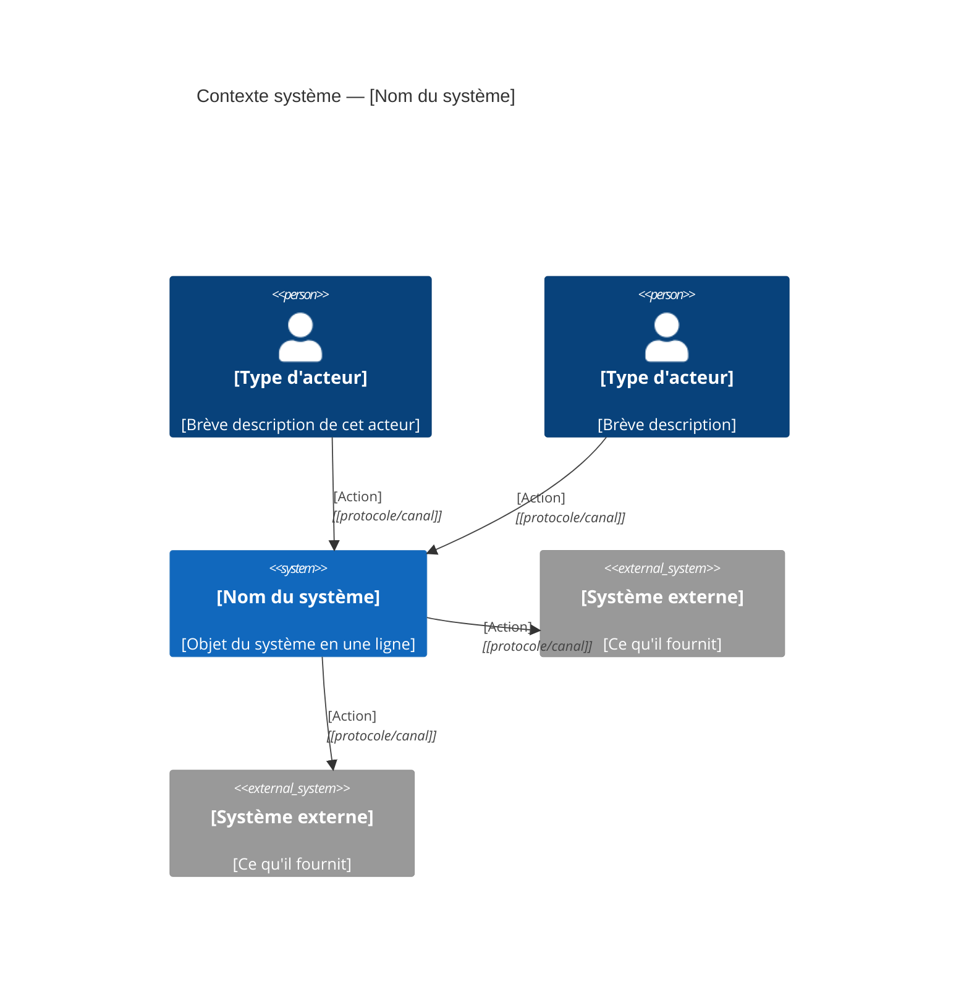
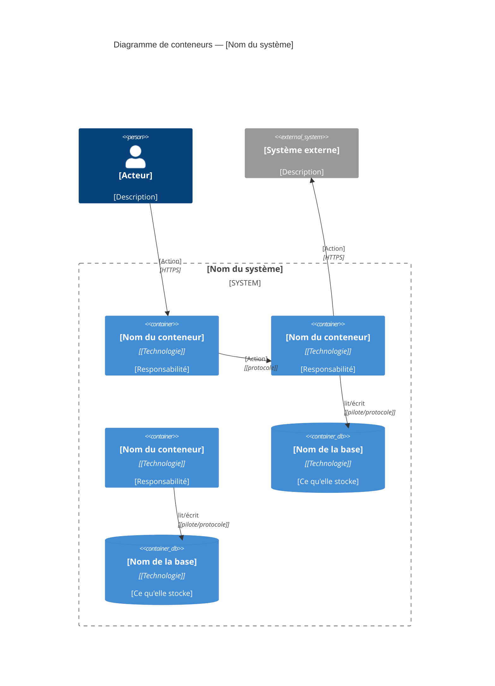
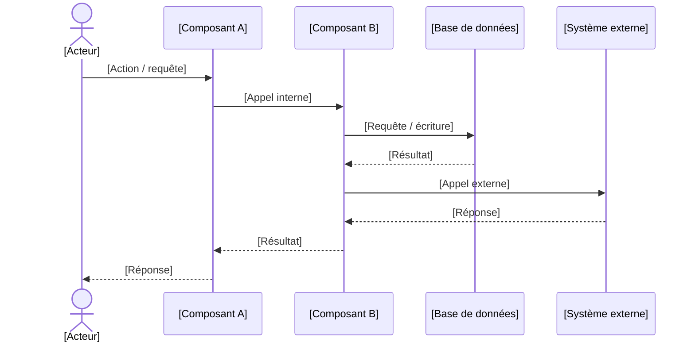
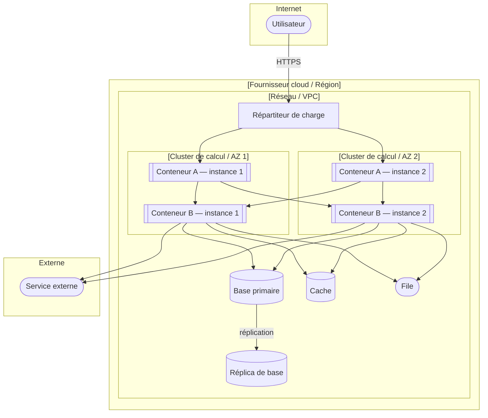

# Diagrammes d'architecture

<!-- Public visé : humains — pour revoir et valider les décisions d'architecture. -->
<!-- Tous les diagrammes utilisent la syntaxe Mermaid. Remplacer chaque [placeholder]
     par des noms réels de l'architecture. Ajouter ou retirer des nœuds pour coller au
     système réel. -->
<!-- Conserver la syntaxe Mermaid intacte. Utiliser [À VALIDER] là où une valeur manque. -->

---

## 1. Diagramme de contexte (C4 niveau 1)

<!-- Montre le système comme une boîte noire et tous les acteurs / systèmes externes
     qui interagissent avec lui. Une boîte par acteur ou système externe ; les flèches
     indiquent le sens de l'interaction avec un libellé court. -->



---

## 2. Diagramme de conteneurs (C4 niveau 2)

<!-- Montre toutes les unités déployables majeures (conteneurs) à l'intérieur de la
     frontière du système et comment elles communiquent. La stack technique de chaque
     conteneur est notée. -->



---

## 3. Diagramme de flux / séquence — [Nom du parcours critique]

<!-- Trace les données à travers le système pour le parcours utilisateur le plus
     important. Répéter cette section pour un second parcours critique si pertinent. -->



---

## 4. Diagramme entité-association (ERD)

<!-- Modèle de données central. Montrer les entités, leurs attributs clés et les
     associations. Utiliser la notation patte-d'oie (crow's foot) pour la cardinalité. -->

```mermaid
erDiagram
  [ENTITE_A] {
    uuid   id          PK
    string [champ]
    string [champ]
    timestamp created_at
    timestamp updated_at
  }

  [ENTITE_B] {
    uuid   id          PK
    uuid   entity_a_id FK
    string [champ]
    timestamp created_at
  }

  [ENTITE_C] {
    uuid   id          PK
    string [champ]
  }

  [ENTITE_A] ||--o{ [ENTITE_B] : "a plusieurs"
  [ENTITE_B] }o--|| [ENTITE_C] : "appartient à"
```

---

## 5. Diagramme de déploiement

<!-- Topologie d'infrastructure : comment les conteneurs sont mappés sur les ressources
     d'infrastructure, et comment ils se connectent. -->


